<!-- Language toggle -->

  
  

<!-- Banner header -->

  

<!-- Typing headline -->

  

<!-- Social -->

  
  
  
  

---

## 🚀 About me

Junior Software Developer and Computer Engineering student at **Universidade São Francisco (USF)**, Brazil. I currently work in software development, continuously improving my skills in system architecture, full stack development, cloud computing and software engineering.

- 🎓 Computer Engineering undergraduate student
- 💼 Junior Software Developer
- 🔧 Electronics Technician — **ETEC Bento Quirino**
- ☁️ Studying **Cloud** technologies and **AWS**
- 🤖 Exploring **Artificial Intelligence**, **Machine Learning**, **LLMs** and **Spec-Driven Development** (SpecForge)
- 📊 Interested in Software Engineering, Cloud Computing, Data, Infrastructure and AI
- 🚀 Always looking to learn new technologies and build scalable solutions

---

## 🛠️ Tech Stack

### Languages

  
  
  
  

### Frameworks & Libraries

  
  
  
  

### Databases

  
  

### Cloud & Tools

  
  
  
  

### AI & Machine Learning

  
  
  
  
  
  
  
  
  

---

## 💡 Skills

- 🌐 Full Stack Development
- 🔗 REST APIs
- 🏛️ Software Architecture
- 🗃️ Data Modeling
- 🧩 Problem Solving
- 🤝 Teamwork
- 🔄 Agile Methodologies
- 📦 Version Control

---

## 🌍 Languages

- 🇧🇷 **Portuguese (Brazilian)** — Native `██████████`
- 🇺🇸 **English** — Intermediate `█████░░░░░░`

---

## 🎯 Goals

To build **robust and scalable solutions**, contributing to projects that create real impact through technology. I have a special interest in **Software Engineering**, **Cloud Computing**, **Infrastructure**, **high-availability systems** and the application of **Artificial Intelligence** to solve real-world problems.

---

## 📊 GitHub Stats

  

  

  

  

---

<!-- Banner footer -->

  

  <em>
    "Don't stop moving forward — we need to grow stronger. 
    The strength we gain comes from the accumulation of results; 
    tasting defeat and savoring victory is what makes us grow. 
    What matters most is that those results exist."
  </em>

